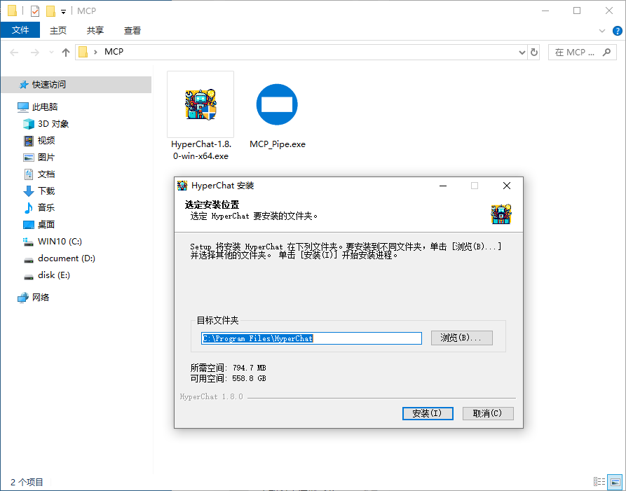
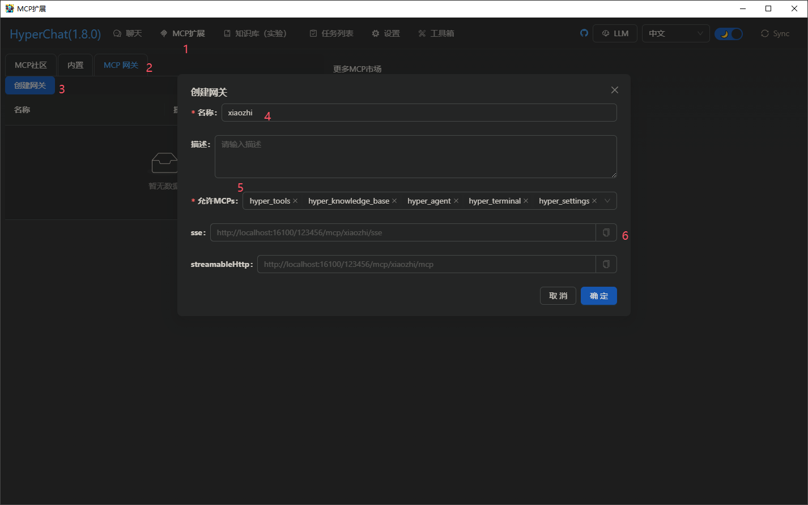
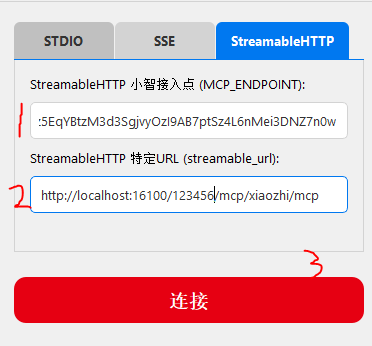
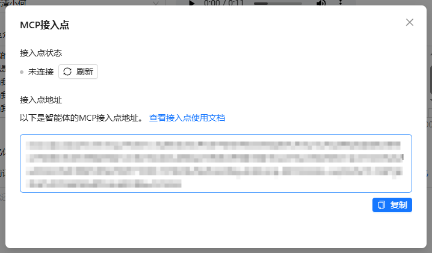
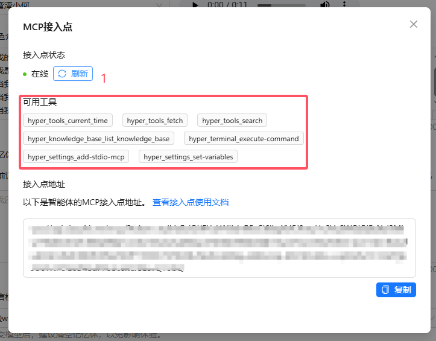

# 小智 MCP 工具连接器 | XiaoZhi MCP Tool Connector

一个强大的 AI 能力扩展工具，支持通过远程控制、计算、邮件操作、知识搜索等方式扩展 AI 的能力。

A powerful tool for extending AI capabilities through remote control, calculations, email operations, knowledge search, and more.

## 🌟 特性 | Features

- 🎯 多模式支持：STDIO、SSE、Streamable HTTP
- 🔌 AI 与外部工具的双向通信
- 🔄 具有指数退避的自动重连机制
- 📊 实时数据流传输
- 🛠️ 简单易用的工具创建接口
- 🔒 安全的 WebSocket 通信
- 💻 直观的图形用户界面

## 📦 安装 | Installation

1. 克隆仓库 | Clone the repository:
   ```bash
   git clone https://github.com/onepy/Mcp_Pipe-Xiaozhi-All.git
   cd Mcp_Pipe-Xiaozhi-All
   ```

2. 安装依赖 | Install dependencies:
   ```bash
   pip install -r requirements.txt
   ```

## 🚀 快速开始 | Quick Start

### GUI 模式 | GUI Mode

1. 运行 GUI 程序 | Run the GUI application:
   ```bash
   python gui_mcp_pipe.py
   ```

2. 在界面中选择连接模式（STDIO/SSE/StreamableHTTP）
3. 填写相应的配置信息
4. 点击"连接"按钮启动服务

## 🔗 与 HyperChat 集成 | HyperChat Integration

### 1. 安装 HyperChat

首先需要安装并运行 [HyperChat](https://github.com/BigSweetPotatoStudio/HyperChat) 服务。HyperChat[HyperChat](https://github.com/BigSweetPotatoStudio/HyperChat) 是一个强大的 AI 对话平台，提供了丰富的插件和工具支持。



### 2. 创建 MCP 网关

在 HyperChat 中创建 MCP 网关，这将允许小智 MCP 工具与 HyperChat 进行通信。



### 3. 配置 MCP 连接

在小智 MCP 工具连接器中配置与 HyperChat 的连接：



1. 选择合适的连接模式（推荐使用 StreamableHTTP）
2. 填写 MCP 接入点地址
3. 填写对应的 URL 配置

### 4. 启动服务

完成配置后，您就可以启动服务，实现与 HyperChat 的连接：





## 🔗 与 ModelScopeMCP 集成 | ModelScopeMCP Integration

首先打开 [ModelScopeMCP](https://www.modelscope.cn/mcp) ，点击右上角进行注册登录，然后寻找标识为 **Hosted** 的应用，这些应用不需本地繁琐部署即可使用


选择想要赋予小智的功能，点击进入MCP服务详情页面，点击右侧连接即可生成SSE连接，同 HyperChat 生成SSE一致，填入即可使用


注意只复制 url 即可，由于SSE单向广播性质，请妥善保管自己的SSE通讯地址，否则别人也能收到你的广播内容


## 🛠️ 配置说明 | Configuration

### STDIO 模式 | STDIO Mode
```yaml
mode: stdio
mcp_endpoint: wss://your-websocket-server.com/ws
script_path: your_mcp_tool_script.py
```

### SSE 模式 | SSE Mode
```yaml
mode: sse
mcp_endpoint: wss://your-websocket-server.com/ws
sse_url: http://localhost:16100/your-path/mcp/sse
```

### Streamable HTTP 模式 | Streamable HTTP Mode
```yaml
mode: streamable_http
mcp_endpoint: wss://your-websocket-server.com/ws
streamable_url: http://localhost:8000/mcp
```

## 📝 开发指南 | Development Guide

### 创建自定义 MCP 工具 | Creating Custom MCP Tools

使用 `FastMCP` 创建您自己的 MCP 工具：

```python
from mcp.server.fastmcp import FastMCP

mcp = FastMCP("YourToolName")

@mcp.tool()
def your_tool(parameter: str) -> dict:
    """Tool description here"""
    result = f"Processed: {parameter}"
    return {"success": True, "result": result}

if __name__ == "__main__":
    mcp.run(transport="stdio")
```

## 🔄 更新日志 | Changelog

### v0.3.0 (当前版本 | Current Version)
- 新增 Streamable HTTP 模式支持
- 实现请求并行化处理
- 优化异步任务管理和错误处理
- 完善 ResponseQueue 类功能

### v0.2.0
- 新增 SSE 模式支持
- 添加 YAML 配置文件支持
- 引入响应队列机制
- 优化日志和错误处理

## 💡 最佳实践 | Best Practices

1. 优先使用 StreamableHTTP 模式，它提供了最好的性能和可靠性
2. 定期保存配置以避免重复输入
3. 使用日志功能进行问题排查
4. 建议与 HyperChat 集成以获得更多功能


## 📄 许可证 | License

本项目采用 MIT 许可证

## 🙏 致谢 | Acknowledgments
- 感谢所有帮助塑造这个项目的贡献者
- 灵感来源于对可扩展AI能力的需求
- 感谢虾哥等所有项目贡献者
- 特别感谢 HyperChat 软件支持


> **推荐使用 [HyperChat](https://github.com/BigSweetPotatoStudio/HyperChat) 作为 SSE/Streamable HTTP 服务端，获取更多小智能力和丰富的对话能力。**
